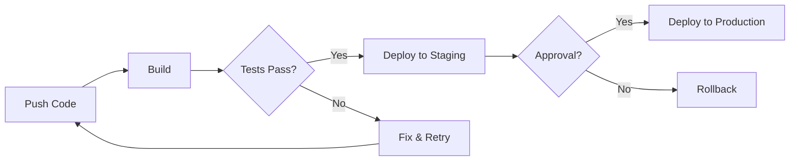
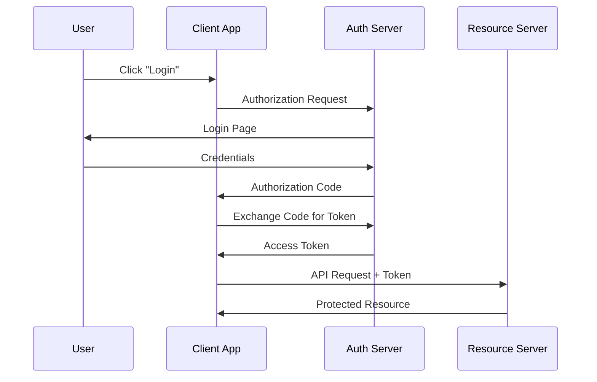
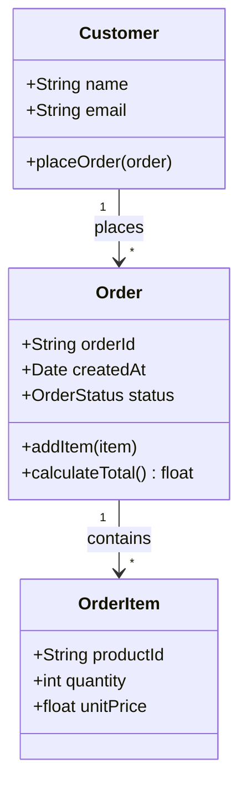
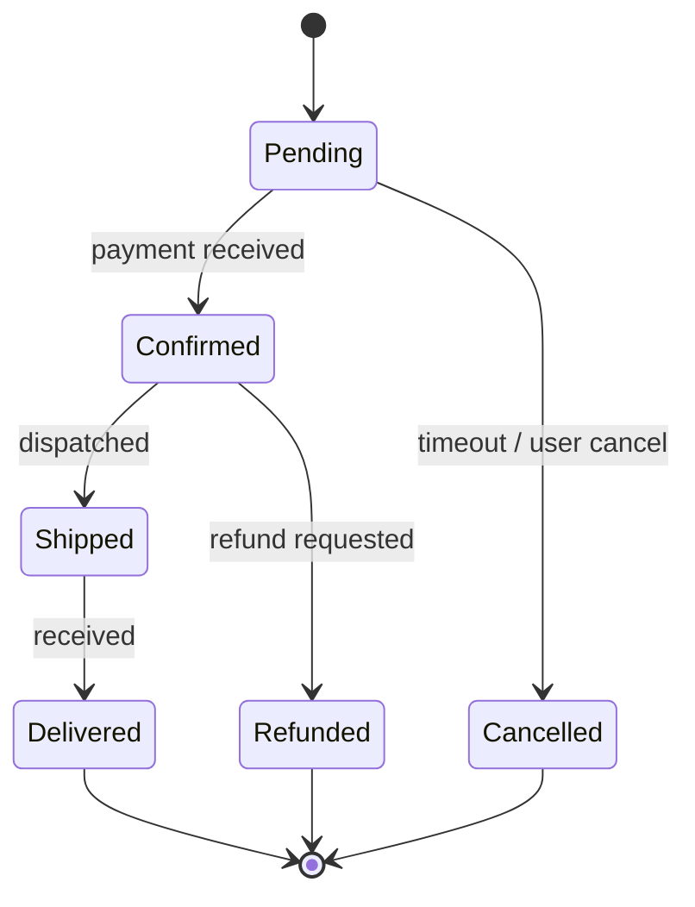
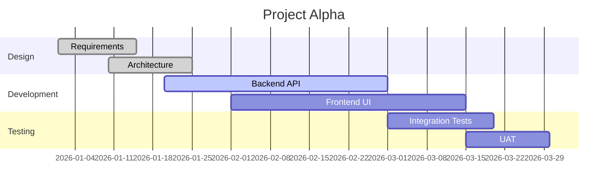
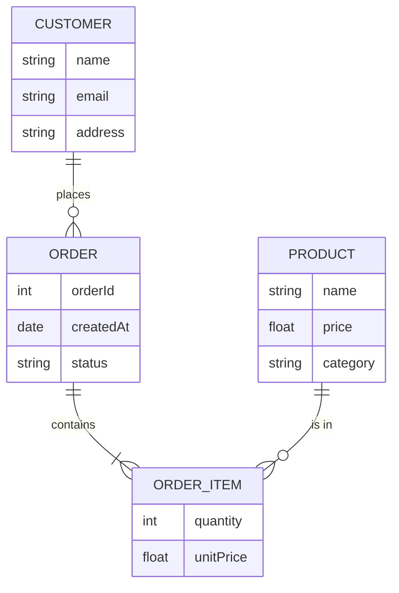
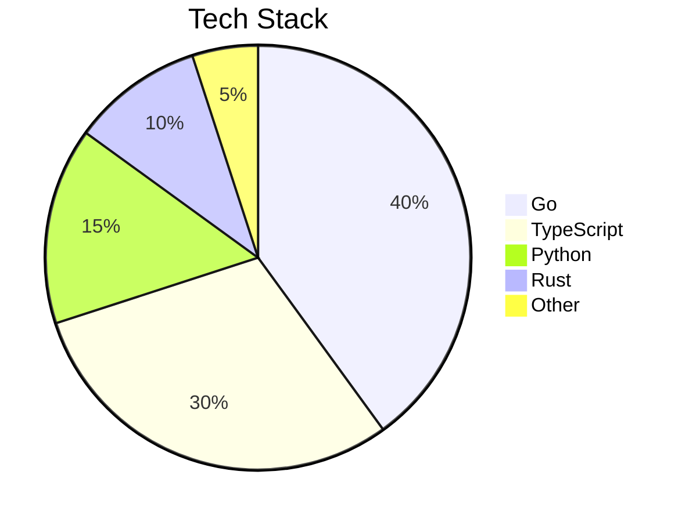

+++
author = "Nicola Gallo"
title = "LaTeX and Mermaid Support in Hugo"
date = "2026-03-06"
description = "A quick guide to rendering math equations with KaTeX and diagrams with Mermaid on this blog."
tags = ["hugo", "latex", "katex", "mermaid", "tutorial"]
draft = true
+++

This blog now supports **LaTeX** math rendering powered by [**KaTeX**](https://katex.org/) and **diagrams** powered by [**Mermaid**](https://mermaid.js.org/). Here is a quick tour of what you can do.

<!--more-->

## Inline Math

Wrap expressions with single dollar signs `$...$` or `\(...\)` to render them inline.

For instance, Euler's identity $e^{i\pi} + 1 = 0$ is often called the most beautiful equation in mathematics.

The quadratic formula \(x = \frac{-b \pm \sqrt{b^2 - 4ac}}{2a}\) solves any second-degree polynomial.

## Display Math

Use double dollar signs `$$...$$` or `\[...\]` for centred, display-mode equations.

The **Gaussian integral** evaluates to:

$$\int_{-\infty}^{+\infty} e^{-x^2} \, dx = \sqrt{\pi}$$

And the **Euler–Lagrange equation** from the calculus of variations:

\[\frac{\partial L}{\partial q} - \frac{d}{dt}\frac{\partial L}{\partial \dot{q}} = 0\]

## Matrices and Systems

KaTeX handles matrices seamlessly:

$$
A = \begin{pmatrix}
a_{11} & a_{12} & \cdots & a_{1n} \\
a_{21} & a_{22} & \cdots & a_{2n} \\
\vdots & \vdots & \ddots & \vdots \\
a_{m1} & a_{m2} & \cdots & a_{mn}
\end{pmatrix}
$$

A system of linear equations can be written as:

$$
\begin{cases}
3x + 2y - z = 1 \\
2x - 2y + 4z = -2 \\
-x + \frac{1}{2}y - z = 0
\end{cases}
$$

## Sums and Products

The **Basel problem**, solved by Euler in 1734:

$$\sum_{n=1}^{\infty} \frac{1}{n^2} = \frac{\pi^2}{6}$$

Euler's product formula for the Riemann zeta function:

$$\zeta(s) = \sum_{n=1}^{\infty} \frac{1}{n^s} = \prod_{p \text{ prime}} \frac{1}{1 - p^{-s}}$$

## Greek Letters and Symbols

LaTeX makes it easy to use Greek letters: $\alpha$, $\beta$, $\gamma$, $\delta$, $\epsilon$, $\theta$, $\lambda$, $\mu$, $\sigma$, $\omega$.

Logical connectives: $\forall$, $\exists$, $\neg$, $\land$, $\lor$, $\implies$, $\iff$.

Set theory: $\in$, $\notin$, $\subset$, $\subseteq$, $\cup$, $\cap$, $\emptyset$.

## A Real-World Example: Bayes' Theorem

Bayesian inference is fundamental in machine learning and statistics:

$$P(A \mid B) = \frac{P(B \mid A) \, P(A)}{P(B)}$$

Where:
- $P(A \mid B)$ is the **posterior probability** of $A$ given $B$.
- $P(B \mid A)$ is the **likelihood** of $B$ given $A$.
- $P(A)$ is the **prior probability** of $A$.
- $P(B)$ is the **marginal likelihood** of $B$.

## Another Example: Maxwell's Equations

Maxwell's equations in differential form, describing the fundamentals of electromagnetism:

$$
\begin{aligned}
\nabla \cdot \mathbf{E} &= \frac{\rho}{\varepsilon_0} \\
\nabla \cdot \mathbf{B} &= 0 \\
\nabla \times \mathbf{E} &= -\frac{\partial \mathbf{B}}{\partial t} \\
\nabla \times \mathbf{B} &= \mu_0 \mathbf{J} + \mu_0 \varepsilon_0 \frac{\partial \mathbf{E}}{\partial t}
\end{aligned}
$$

---

## Mermaid Diagrams

[**Mermaid**](https://mermaid.js.org/) lets you create diagrams and visualisations directly in Markdown using a simple text-based syntax. Just use a fenced code block with the `mermaid` language identifier.

### Flowchart

A simple CI/CD pipeline:

### Sequence Diagram

An OAuth 2.0 authorization code flow:

### Class Diagram

A simple domain model:

### State Diagram

Order lifecycle:

### Gantt Chart

A project timeline:

### Entity Relationship Diagram

A database schema:

### Pie Chart

Technology stack distribution:

---

## Conclusion

With **KaTeX** and **Hugo's Goldmark passthrough extension**, you can write LaTeX directly in your Markdown files without any shortcodes or special wrappers. Both inline (`$...$`) and display (`$$...$$`) delimiters work out of the box.

**Mermaid** diagrams work just as seamlessly — simply use a fenced code block with the `mermaid` language tag, and the diagram is rendered automatically in the browser.
